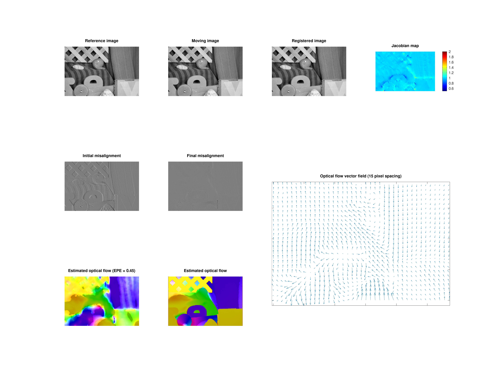

# OpticalFlow2d: A C++ implementation of optical flow methods for 2D deformable image registration

## Horn-Schunck optical flow
OpticalFlow2d estimates a deformation vector field (DVF) quantifying the motion between two misaligned images. This project provides a C++ implementation of the [Horn-Schunck optical flow method](https://en.wikipedia.org/wiki/Horn%E2%80%93Schunck_method) to estimate the DVF. This method estimates the DVF as the minimizer of the cost function:

$\displaystyle \mathbf{u}^* = \underset{\mathbf{u}}{\textnormal{arg min}} \frac{1}{2}\int(I_t + \mathbf{u}\cdot\nabla I)^2\mathrm{d}\mathbf{x} + \frac{\alpha}{2} \int \lVert D\mathbf{u}\rVert_F^2\mathrm{d}\mathbf{x}$

Some details on the model implementation:
1. Coarse-to-fine multiresolution method for estimation of large deformation
2. Gaussian filtering between resolution levels for anti-aliasing.
3. Convergence if relative improvement is below user-defined threshold.
4. Follows the efficient numerical model derived from the Euler-Lagrange equations.
5. Image gradients ($I_t$ and $\nabla I$) are estimated with separable convolution kernels.
6. (Operations on) the Image and Motion class are implemented in header-only (.hpp) files, which should allow for an easy implementation of other image processing tasks in future projects.

Details on the implementation of points (1-4) are given in [here](https://www.ipol.im/pub/art/2013/21/)

## Cornelius-Kanade model
When image intensity between image frames is not conserved, the Cornelius-Kanade model estimates an additional parameter, c, to separate image intensity variations from motion. The corresponding cost function is given by:

$\displaystyle (\mathbf{u},c) = \underset{(\mathbf{u},c)}{\textnormal{arg min}} \frac{1}{2}\int(I_t + \mathbf{u}\cdot\nabla I - c)^2\mathrm{d}\mathbf{x} + \frac{\alpha}{2} \int \lVert D\mathbf{u}\rVert_F^2\mathrm{d}\mathbf{x} + \frac{\beta}{2}
\int_\Omega \lVert \nabla c\rVert^2\mathrm{d}\mathbf{x}$

A derivation of the numerical implementation is given in the docs folder.

# Compilation

These optical flow methods are implemented in the C++, which can be compiled with `cmake`. The `CMakeLists.txt` file contains instructions to create a static library in the build directory, which is consequently linked to:
1) a standalone C++ implementation,
2) a Matlab Executable (MEX) wrapper to launch from Matlab/GNU Octave with local workspace variables.

The standalone C++ depends on the [(single-include) nlohmann json parser](https://github.com/nlohmann/json) and the [CImg.h](https://cimg.eu/) header files (add these to the include directory). Compilation of the .mex function requires the `mkoctfile` compiler and the location of `mex.h` header file. The project is then build with the commands:

```
cmake -S . -B build
cmake --build build -j
```

creating binaries in the dedicated directories.

# Running the examples

Examples are given to launch the application for C++ and Octave, both depending on the .json configuration file containing the registration parameters. The .json file in the example folder is as follows:

```
{
    "reference_image": "path/to/reference/image",
    "moving_image": "path/to/moving/image",

    // Parameters below are options. If none given, the following default values are used:
    "optical_flow_option": "horn-schunck",

    "registration": {
        "nrefine": 0,
        "niter": [100, 100, 100, 100],
        "alpha": 0.1,
        "beta": 5.0,
        "resampling_factor": 0.5,
        "eps": 0.0001
    }
}
```


The example directory contains scripts to launch the image registration model from the command line, as a C++ standalone implementation, or from GNU Octave. Both use the images from [Middlebury Flow dataset](https://vision.middlebury.edu/flow/data/), as well as the ground truth and Matlab scripts.

The standalone C++ implementation can be run launching the executable from the example directory: ```./example/opticalflow2d_middlebury ./example/config_middlebury.json```. The GNU Octave script ```opticaflow2d_middlebury.m``` reads the .json configuration file, converts it to a structure and loads into the MEX function. It can be launched from the terminal through ```octave --persist ./example/opticalflow2d_middlebury.m```.

# Results: proof-of-principle
As a proof-of-princple, the Middlebury _flow_ dataset was used for validation of the estimated deformation fields. 



# Code testing

The tests directory contains unit, integration and system tests for the implementation of the image registration model. These tests are compiled and executed using Google's GTest testing framework. To compile the tests, run the cmake command with the ```-DBUILD_TESTS=ON``` flag. This creates the ```testOpticalFlow2d``` executable in the build directory: 
```
./build/testOpticalFlow2d
```

